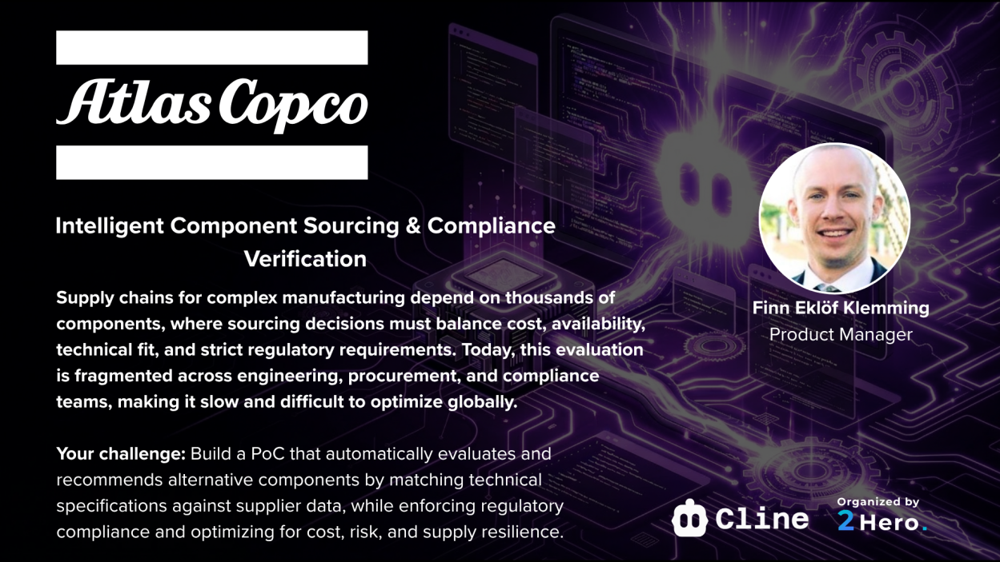
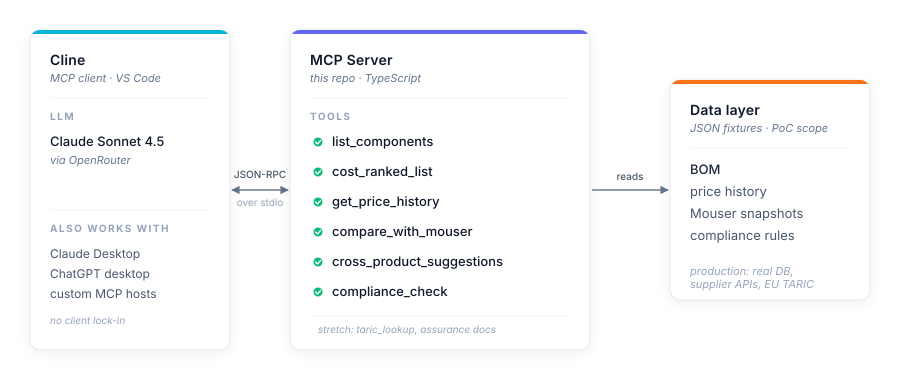

# Component Sourcing Compass

A natural-language sourcing assistant for manufacturing teams. Ask about your bill of materials, supplier prices, and compliance status; get answers in seconds.

Built for the **Cline AI-Assisted Enterprise Coding Hackathon** on the Atlas Copco *Intelligent Component Sourcing & Compliance Verification* track.



## What it does

A typical sourcing question today involves cross-referencing component data across ERP, PLM, supplier portals, datasheets, and regulatory feeds. Work that takes weeks. This project exposes that same data through a small set of MCP tools so an LLM can answer the question conversationally:

> **You:** What components are in Atlas Compressor Model A and what does it cost?
>
> **Cline:** Model A contains an aluminium housing (1×, €42.50), a 3kW three-phase motor (1×, €187.00), and 12mm brass check valves (2×, €8.25 each). BOM cost: €245.50.

Today the server answers BOM lookups. Phase 2 adds price history and Mouser comparisons; Phase 3 adds compliance flags and TARIC lookups. The chat surface stays the same as tools are layered in.

## Concepts

You only need two ideas to follow the rest of this repo.

**BOM (Bill of Materials).** The parts list for a manufactured product, with quantities. Like an ingredients list on a recipe, but for a compressor: *Atlas Compressor Model A = 1× aluminium housing, 1× 3kW motor, 2× check valves*. The BOM is the spine of every question this server answers. Every cost figure, supplier alternative, and compliance check is anchored to a component on a BOM. Our seed BOM lives in [data/bom.seed.json](data/bom.seed.json) and its shape is defined by [data/schemas/bom.schema.json](data/schemas/bom.schema.json).

**MCP (Model Context Protocol).** A standard interface that lets LLM apps call external services. Think USB for AI. This repo is an *MCP server*: it exposes a small set of *tools* (functions like `list_components`) that an *MCP client* (Cline, Claude Desktop, any compatible host) can call when the user asks a question. We wrote the tools; the LLM does the language understanding.

That's it. Everything else is implementation detail.

## Quick start

You'll need: VS Code, Node 20+, npm, and an OpenRouter API key.

### 1. Install dependencies

```sh
git clone https://github.com/kshyatisekhar-panda/component-sourcing-compass.git
cd component-sourcing-compass
npm install
npm run typecheck
```

`typecheck` is optional but confirms the TypeScript compiles before you wire up the client.

### 2. Install the Cline extension

Open VS Code, then the Extensions panel (`Ctrl+Shift+X` / `Cmd+Shift+X`), search **Cline**, and install the one published by Cline (Saoudrizwan). A new Cline icon appears in the left sidebar.

### 3. Configure the LLM provider

Click the Cline icon, then the gear icon at the top of the Cline panel to open settings.

- **API Provider:** OpenRouter
- **OpenRouter API Key:** paste your key
  - Get one at [openrouter.ai/keys](https://openrouter.ai/keys) (top up with a few dollars; this PoC costs cents per query)
  - Hackathon participants: use the OpenRouter key from your team channel
- **Model:** `anthropic/claude-sonnet-4.5` — strong tool-use, 200K context, plenty for this PoC

Cline stores the key locally; it never leaves your machine except to call OpenRouter.

### 4. Connect the MCP server to Cline

In the Cline panel, click the **MCP Servers** icon → **Edit MCP Settings**. This opens `cline_mcp_settings.json`. Add:

```json
{
  "mcpServers": {
    "component-sourcing-compass": {
      "command": "npm",
      "args": ["start", "--silent"],
      "cwd": "<absolute path to this repo>"
    }
  }
}
```

Save the file. Cline auto-reloads and the server should appear with a **green dot** in the MCP Servers list.

> The `--silent` flag is required. Without it, npm's preamble lines hit stdout and corrupt the JSON-RPC stream over stdio.

### 5. Try it

In a new Cline chat:

> *Use the component-sourcing-compass server to list the components in product PROD-AC-COMP-001.*

Cline calls `list_components`, displays the tool call and JSON response, then summarises in plain English. To skip per-call approvals during a demo, click **Auto-approve → MCP** in the chat footer.

### Troubleshooting

| Symptom | Likely cause |
| ------- | ------------ |
| Red dot next to the server in Cline | wrong `cwd` in `cline_mcp_settings.json` (use forward slashes), or `npm` not on PATH for the VS Code subprocess |
| Cline answers without calling the tool | LLM didn't recognise the request — be explicit ("use the component-sourcing-compass server to ...") |
| `npm start` works in the terminal but Cline shows JSON parse errors | the `--silent` flag is missing from the Cline config |

## Architecture



For the proof of concept the data layer is JSON fixtures. Production swaps them for the customer's BOM database, supplier APIs, and compliance feeds; the tool surface stays unchanged.

A separate Python data-generation track produces the fixtures, validated against schemas in [data/schemas/](data/schemas/). See [docs/project-and-brainstorm.md](docs/project-and-brainstorm.md) for the full PoC charter, scope, and team decisions.

## Project layout

```
src/
├── index.ts                       MCP server bootstrap, registers all tools
├── bom.ts                         BOM types and loader
├── compliance.ts                  rule engine (RoHS, REACH, conflict minerals)
├── mouser.ts                      Mouser API client + recorded fallback
├── tavily.ts                      Tavily web search fallback
├── config.ts, tool-response.ts    shared helpers
└── tools/
    ├── list-components.ts
    ├── cost-ranked-list.ts
    ├── get-price-history.ts
    ├── compare-with-mouser.ts
    ├── cross-product-suggestions.ts
    └── compliance-check.ts
data/
├── bom.seed.json                  BOM fixture
├── price-history.seed.json        monthly price history per component
├── compliance-rules.seed.json     regulatory rules (EU + US)
└── schemas/                       JSON Schema contracts
docs/
└── project-and-brainstorm.md      PoC charter, brainstorm, decisions
```

## Roadmap

| Phase | Capability                                                  | Status      |
| ----: | :---------------------------------------------------------- | :---------- |
|     1 | `list_components`                                           | ✅ shipped   |
|     2 | `cost_ranked_list`, `get_price_history`, `compare_with_mouser`, `cross_product_suggestions` | ✅ shipped   |
|     3 | `compliance_check` (RoHS, REACH, Dodd-Frank 1502)           | ✅ shipped   |
|     - | `taric_lookup`, automated assurance docs                    | stretch     |

## Team

_Add team members here._
